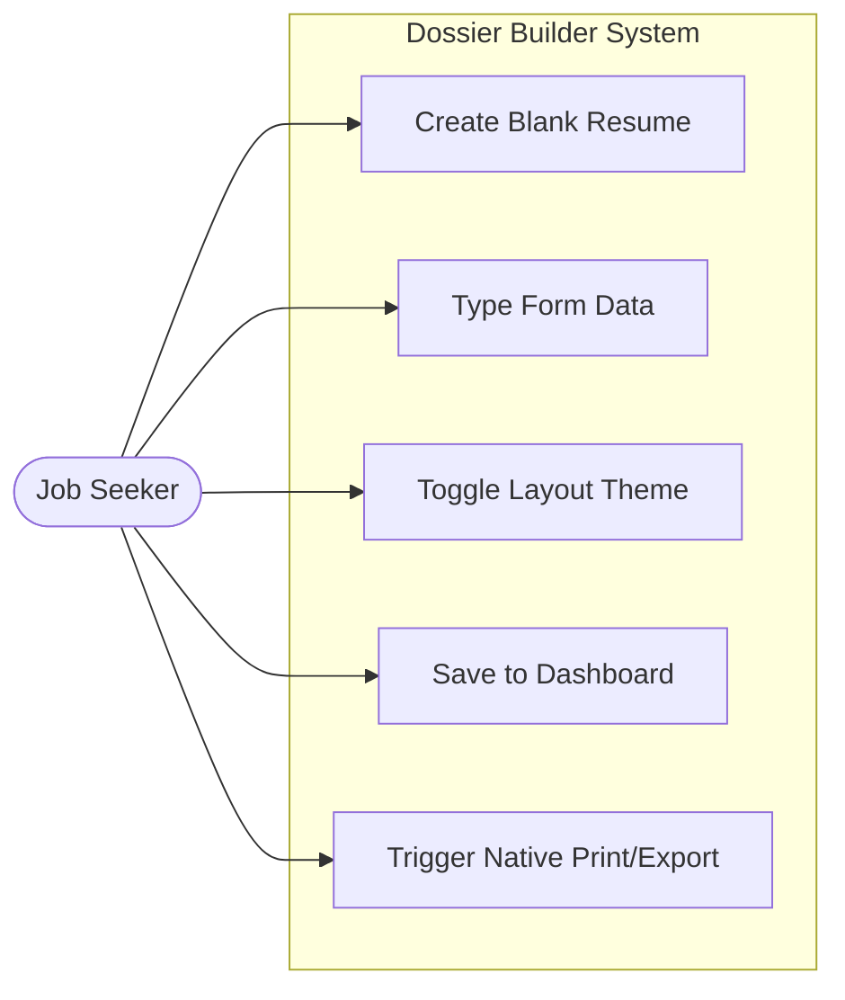

# Final Presentation: Dossier Builder
**Frontend Development (JS, React JS)**

*Note to Speaker: This document is written as a dual-purpose guide. It serves as your structural submission and provides in-depth talking points to secure top marks in the "Presentation Clarity", "Understanding", and "Overall Project Quality" assessment criteria.*

---

## 1. Introduction

* **Project Overview:** "Dossier Builder" is a highly interactive, modern Single Page Application (SPA) designed to help individuals construct professional, beautifully formatted, and exactly-scaled A4 resumes directly in their web browser.
* **The Problem:** Crafting a clean resume that survives exporting is surprisingly difficult. Standard word processors (like MS Word) suffer from brittle formatting that breaks across systems. Meanwhile, popular online web tools often lock users behind paywalls, force intrusive watermarks, or fail to accurately represent how a webpage translates to a physical A4 grid when printed or saved to PDF.
* **Background Context:** In highly competitive job markets—especially within the tech and creative sectors—a resume is an applicant's first critical point of contact. The structural integrity and visual aesthetic of that document matter immensely. This project democratizes access to robust, privacy-focused resume layouts without demanding intense design or coding skills from the user.
* **Target Users:** Job seekers, university students, and professionals who prioritize data privacy, speed, and premium aesthetics, and who need completely free, instant PDF export capabilities.

---

## 2. Objectives (Maximum 3)
To ensure the project remained focused and highly technical, it was engineered around three strict goals:

1. **Zero-Latency Live Previewing:** To leverage React's unidirectional data flow to build a robust split-screen interface where form data instantly mutates the central state, dynamically re-rendering an A4-scaled preview without any server-side layout delays.
2. **Precision Print CSS Engineering:** To master browser-level stylesheets (`@media print` rules, `page-break-inside: avoid` constraints, and CSS transforms) to strictly lock DOM elements into perfect 210x297mm A4 dimensions, ensuring what the user sees on screen is exactly what exports to PDF.
3. **Privacy-First Data Persistence:** To develop a robust, 100% client-side data management system utilizing the Browser's LocalStorage API with intelligent debouncing, ensuring user data is safely persisted between sessions without ever transmitting sensitive personal information to a public cloud server.

---

## 3. Scope and Limitations

### a. Scope (What the application does)
* **Modular Form Inputs:** Dynamic, state-mapped modules for Personal Information, Education histories, Experiences, Projects, Skills, and Languages.
* **Algorithmic A4 Scaling:** An intelligent preview pane that calculates mathematical CSS `transform: scale()` metrics to gracefully fit a physical A4 document inside varying laptop and monitor viewport sizes.
* **Distinct Visual Layouts:** Three highly developed templates—Modern (Startup-focused), Professional (Corporate/Executive), and Creative (Design-focused)—that dynamically consume the central JSON state object.
* **Dashboard Management:** A local file-system equivalent that arrays saved resumes, injecting UI components to manage, load, and delete drafts seamlessly.

### b. Limitations (What is NOT included / Constraints)
* **No Cloud Database/Sync:** Constrained by the purely frontend scope, data is exclusively tied to the user's local browser memory. Clearing browser cache permanently destroys the data. Authentication and remote API syncing are intentionally omitted.
* **Strict Single-Page Pagination Constraints:** Because rendering dynamic HTML to physical PDF pages relies heavily on unpredictable browser print engines, extremely verbose resumes that exceed 1123px in height suffer from content clipping instead of intelligently wrapping to a replicated second page.
* **Time Constraints on Image Handling:** Due to LocalStorage's string-size limits, users must input external URLs (e.g., LinkedIn avatars) for profile pictures rather than uploading base64-encoded local image files.

---

## 4. Methodology

### a. Tools & Technologies
* **React JS (Core Library):** Extensively used Functional Components, Hooks (`useState`, `useEffect`), and conditional JSX rendering to manage complex, deeply nested UI states.
* **Tailwind CSS (Styling):** Utilized for utility-first, rapid UI development. Allowed for complex flexbox/grid layouts, responsive breakpoints, and custom spacing metrics without muddying global stylesheets.
* **Vite (Build Tool):** Chosen over Create React App (CRA) for significantly faster Hot Module Replacement (HMR) and an optimized final production bundle.
* **HTML5 LocalStorage API:** Used extensively alongside React `useEffect` hooks and `setTimeout` debouncing techniques to simulate a local database.

### b. Use Case Diagram
*(For the Final Presentation, you will need to replace this text block with a screenshot of the diagram below generated in draw.io or Visio. This visually demonstrates the interaction between the User Actor and the System Boundary.)*

* **Main Actor:** The Job Seeker (User).
* **Main Actions:** Data entry, layout selection, local preservation, and native browser exporting.

### c. System Diagram
*(For the Final Presentation, insert a visual block diagram showing this exact component tree and data flow.)*

**System Component Hierarchy (React Tree):**
* `<App />` (Highest level component; governs universal state `resumeData` and `activeTab`)
    * `<TopNavigation />` & `<SideNavigation />` (Stateless UI components)
    * `<DashboardView />` (Reads/Writes to LocalStorage Array)
    * `<EditorPanel />` (Iterates and renders specific form fields)
        * `<PersonalInfoForm />`, `<ExperienceForm />`, etc. (Calls state mutation functions via props)
    * `<PreviewPanel />` (Engine that handles zoom/scaling math)
        * `<ResumeDocument />` (Data-injection controller)
            * `<ModernTemplate />`, `<CreativeTemplate />`, `<ProfessionalTemplate />` (Dumb UI shells)

**Data Flow Explanation (Unidirectional Flow):**
1. **Source of Truth:** The `resumeData` object permanently resides in `App.jsx`.
2. **Prop Drilling:** This state object is passed *downward* into the `PreviewPanel` and the `EditorPanel`.
3. **Lifting State Up:** As users type into input fields inside the `EditorPanel`, child components trigger callback functions (e.g., `updateEntry`) passed down via props. These functions execute in `<App />`, overwriting the core state, which immediately trickles down into `<PreviewPanel />`, triggering a flawless live-update.

### d. Algorithms / Flow (Process)
**How the application technically operates step-by-step:**
1. **App Initialization & Hydration:** Upon mounting, `App.jsx` evaluates the browser's `localStorage` via a lazy state initialization hook. If `dossier_data` exists, it parses the JSON string into active state; otherwise, it injects an empty string-schema structure.
2. **State Debouncing Loop:** Every time state transforms, a `useEffect` hook triggers. To prevent massive performance bottlenecks from spamming `localStorage` on every single keystroke, a `setTimeout` debouncer collects changes for 1000ms before silently saving them to disk.
3. **Dynamic Viewport Scaling:** Inside `PreviewPanel`, the window dimensions are tracked. The CSS transform explicitly scales the `#resume-pdf-target` (which is hardcoded to 210x297 millimeters) by a fractional multiplier `(e.g., scale(0.65))` so the physical aspect ratio fits elegantly on smaller monitors without squishing the UI.
4. **Native Printing Bridge Engine:** When the user clicks print, a powerful block of `@media print` CSS activates. It hides the navigation, strips the CSS dynamic scale out of the DOM, applies `overflow: hidden !important` to clip the document at exactly 1 page length, and invokes the `window.print()` browser API, instructing Chrome/Edge to snapshot exactly the hidden A4 bounding box.

---

## 5. Results

**What is specificially Completed:**
* Seamless, highly responsive split-pane React application without visual latency.
* Advanced Array state manipulation algorithms allowing users to securely add, re-write, map, and delete object data inside arrays (Experiences, Projects) dynamically.
* Complex CSS print engineering that successfully maps web layouts to physical paper dimensions locking widths to standard A4 mm.
* A robust local dashboard interface that caches arrayed saves sequentially.

**What is Not Done:**
* Backend cloud architecture (User accounts, remote sync via Axios or Fetch API).
* Automated multiline pagination (if experience sections drag excessively long, the text trims instead of flowing intelligently to a duplicated page 2).
* Drag-and-drop structural DOM manipulation for rearranging the order of input entries internally without manually copy-pasting text.

---

## 6. Conclusions

* **Summary of Achievements:** This project proved the immense power of React JS for handling complex, rapidly-mutating nested object states without mutating the DOM directly. We achieved an incredibly polished UI with zero latency, entirely localized in the client environment.
* **Reflection on Objectives:** 
  * *Were they met?* Yes. The application successfully delivers live previewing, executes strict print dimensions successfully matching A4 boundaries, and reliably persists the data locally.
* **Core Technical Learnings:**
  1. **Immutable State Traps:** Direct array mutation in React breaks re-rendering. Iterating over object arrays mapping IDs to specific modifications (using the spread operator `...prev`) is drastically more complex than simple string updates, demanding careful functional component architecture.
  2. **Browser Rendering Discrepancies:** Standard CSS flexbox styling behaves radically differently when filtered through an operating system's native Print API. Mastering `@media` queries and the `page-break` properties was crucial and extremely tedious.
  3. **The Strength of Utility-First CSS:** Tailwind heavily accelerated the ability to design multiple radically distinct templates (Modern vs. Professional) rapidly by decoupling CSS naming conventions from the HTML markup.

---

## 7. Demo Structure
*(Guideline for your 15-minute presentation demo)*

* **Step 1:** Run `npm run dev` and navigate to `localhost`. 
* **Step 2 (The Dashboard):** Open the local storage overview. Show that multiple resumes can be cached locally.
* **Step 3 (The Magic Button):** Click "New Resume" and then immediately engage the "Fill with Example" button to illustrate instant React state hydration to the audience.
* **Step 4 (Latency Proof):** Add a brand new skill to the "Technical Expertise" form. The audience will see it instantaneously split via comma parsing and populate in the right-hand panel, proving the lack of server processing delays.
* **Step 5 (Scalability):** Hot-swap between the three visual templates. Note how the underlying `resumeData` object stays consistent, while the `ResumeDocument` injects it differently depending on the chosen template's mapped properties.
* **Step 6 (The Export):** Execute `Ctrl+P` or the in-app "Print" mechanism. Show that the surrounding React UI vanishes, the scale locks perfectly, and the dialogue exports an un-watermarked, perfectly padded PDF.
